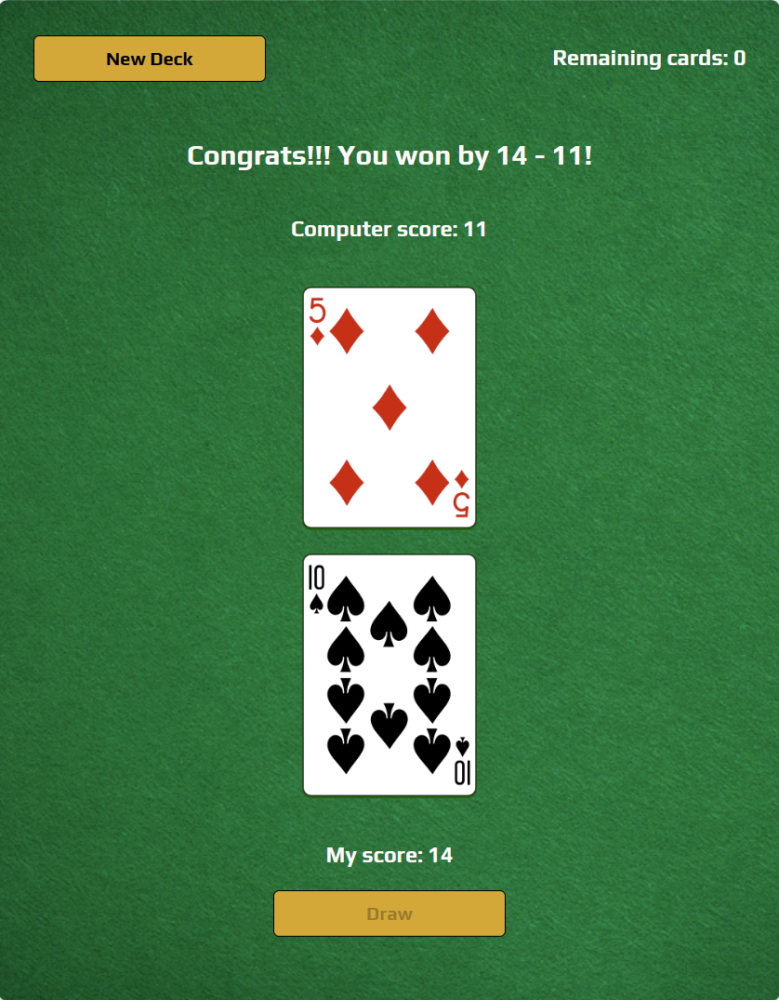

# Game of War

## Description
This card game calls the [Deck of Cards API](https://www.deckofcardsapi.com/) (through Scrimba) and fetches 52 shuffled cards. When clicking "Draw" two cards are drawn - one for the computer and one for you. Highest value wins this round. 

When all cards are drawn the winner of the game is announced!

This version uses "async await" instead of "then".
 
 

## Technologies
- HTML
- CSS
- JavaScript

## Live link
The app is deployed here:
[https://toms-war-game.netlify.app](https://toms-war-game.netlify.app)

Please feel free to visit and try the game!
